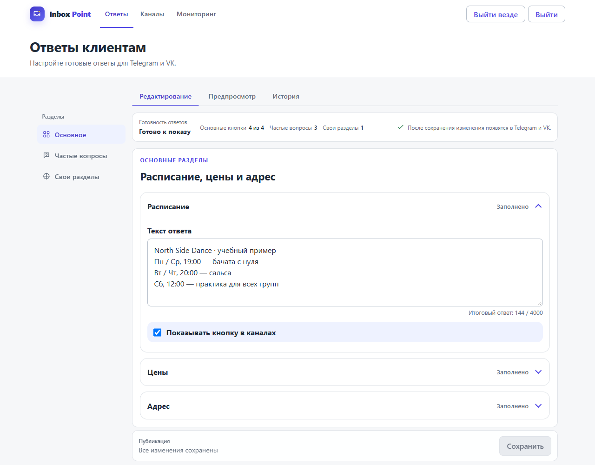
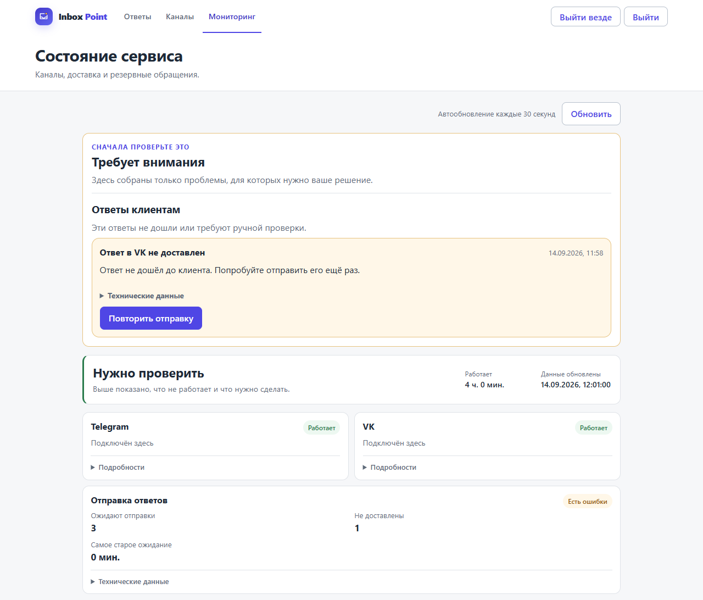

# Inbox Point

Inbox Point is a self-hosted service that brings customer conversations from
Telegram and VK into a private Telegram workspace for operators. Customers stay
in their messenger; your team answers in Telegram.



## How it works

1. A customer writes to your Telegram bot or VK community.
2. Inbox Point answers configured questions about schedules, prices, addresses,
   FAQs, or custom sections.
3. A question needing a person opens an operator request in the customer's
   Telegram Topic, creating the topic on first contact.
4. An operator replies in that topic.
5. Inbox Point sends the answer back to the customer's original conversation.

Operators close finished requests. Later conversations open a new request and
reuse the customer's topic when available.

## What it supports

- Text conversations from Telegram bots and VK communities.
- Configurable schedules, prices, addresses, FAQs, and custom menu sections.
- A protected emergency web inbox when Telegram is unavailable.
- Saved outbound messages with retries and controls for delivery incidents.
- Channel setup, content editing, preview, and revision history.
- Service monitoring, verified snapshots, and external backups.

Attachments, voice messages, AI-generated replies, CRM entities, operator
assignment, multi-tenant SaaS, and billing are outside the current release.
Unsupported attachments prompt the customer to resend their question as text.

## Engineering highlights

- **Durable delivery.** Replies are saved in SQLite before sending and retried
  within set limits; pending work survives a restart.
- **Uncertain outcomes.** A confirmed failure differs from a lost confirmation:
  when Telegram may have accepted an action, the service asks for resolution
  instead of blindly repeating it.
- **Duplicate protection.** Stored event IDs and operation keys prevent duplicate
  requests and side effects. Repeatedly failing VK events are isolated for review.
- **Emergency fallback.** An active request can move to the protected web inbox.
  A request uses one workspace at a time.
- **Verified recovery.** Snapshots are checked before restore. Restored admin
  sessions are invalidated; devices must sign in again.
- **Useful monitoring.** Readiness checks channel and delivery-worker activity,
  queue delays, and unresolved inbound or operator-relay incidents.

## Screenshots

Actual Russian-language UI with synthetic data: fictional **North Side Dance**
content above; a failed VK reply, retry action, and service state below.



[Reproduce the screenshots](tests/e2e/docs-screenshots.spec.ts) without real accounts.

## Stack

TypeScript · Node.js · Fastify · SQLite · Vue 3 · Playwright

## Run locally

Requires Node.js 24.20.x and npm 11.

```bash
npm ci
npm run dev
```

At `http://127.0.0.1:3000`, use `/setup` for channels, `/manage` for content,
and `/ops` for monitoring and emergency requests. Local loopback access needs no
password. Set `ADMIN_PASSWORD` for `/login` and optional remembered sessions;
production requires it. `dev` and `start` load an untracked `.env`;
see [`.env.example`](.env.example).

Run `npm run check` for formatting, lint, types, tests, and builds. For browser
checks, run `npx playwright install chromium`, then `npm run check:e2e`.

## Documentation

- [Deployment](deploy/README.md) — one isolated instance per organization.
- [Administration and channels](deploy/README.md#administration-and-channel-lifecycle)
  — authentication, connections, and content behavior.
- [Monitoring](deploy/README.md#6-configure-monitoring) and
  [backups / restore](deploy/README.md#7-back-up-and-restore).
- [Acceptance and failure drills](deploy/README.md#8-acceptance-and-failure-drills).

## Status

Core flows and reliability mechanisms are implemented and covered by automated
checks. Production acceptance still requires verification on the target
deployment: real channels, restart and failure drills, restore, rollback, and
the operator workflow.

## License

[MIT](LICENSE)
